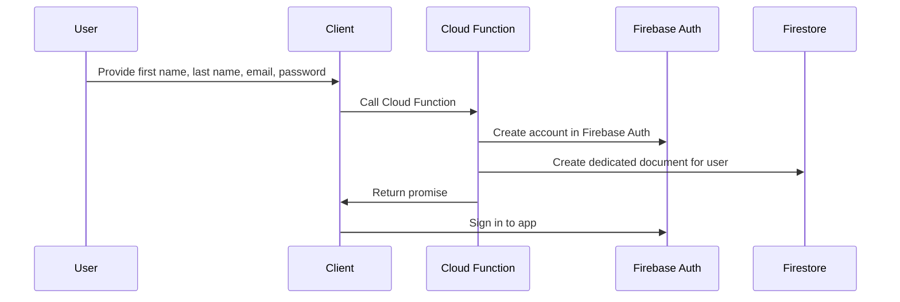

# Registration Process on Cuttinboard

The registration process on Cuttinboard involves several steps and uses different tools to accomplish the task. To create a new account on Cuttinboard, a user must provide the following information:

- First name
- Last name
- Email
- Password

Once the user has provided this information, the following steps are taken to complete the registration process:

1. The client side calls a Firebase Cloud Function that uses the Firebase Admin Auth SDK to create a new account in Firebase Auth. The display name for the account is created by concatenating the user's first and last names.
2. The Cloud Function also creates a dedicated document for the user in Firestore to store their personal information.
3. Once the account is created, the Cloud Function returns a promise to the client side.
4. The client side uses the provided information to sign in to the app, completing the registration process.

This system allows Cuttinboard to gather detailed information about each user, including their first and last names, and store it in Firestore for future reference. It also ensures that each user has a unique display name in Firebase Auth to avoid potential confusion.

